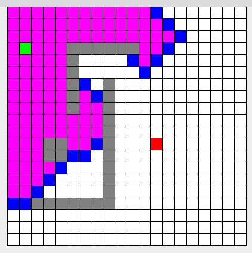

# Pathfinding Visualization

A pathfinding visualizer built using Java and Maven.

# Compiling

In `pathfinding-visualization/src/main/java/org/codeberg/denniskaydalov` run

    javac *.java

# Running

To run the application, execute

    java App.java

in the same directory as the compiled files.

# Preview

The application visualizes the process of finding the optimal path from start to finish.

